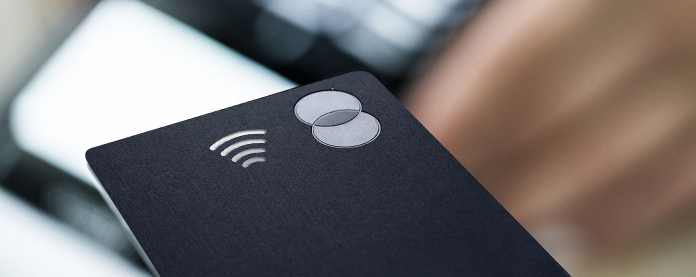

According to a Mastercard study, contactless transactions have increased by 97% in Europe.
In France, growth would be 156% between January 2017 and August 2018! While Asia, with China as a precursor, had already adopted the service for years, a lagging Europe is (finally) seeing this use, which has hitherto been shunned, grow.

===

**Contactless payment in a nutshell**
Paradoxically, "contactless" payment is in fact the functionality of a payment medium allowing payment to be made by simple contact (without entering your PIN code).
Contactless payment or “Tap & Go” is a “radio-identification” data recognition technology. This is short distance communication. We are talking about RFID (Radio Frequency Identification) or NFC technology. Any system integrating a chip and a dedicated antenna can therefore offer contactless payment. In general, the >>> pictogram indicates whether a support has this functionality.

Cardholders are more and more seduced and more and more invited by merchants to use this feature. Little by little, contactless payment is taking off by making in-store purchases more fluid. Today, in Europe, an estimated 50% of POS (physical point of sale) transactions are carried out without contact, and this figure is only increasing. The increase in the spending limit by contactless payment from € 20 to € 30 in October 2017 largely contributed to this increase. More than 2 billion transactions were thus carried out, with a milestone of 3 billion estimated to be exceeded by 2020.

Payment networks such as Mastercard and Visa are constantly investing in this area and are stepping up actions aimed at equipping the entire fleet of cards and payment terminals with functionality. As explained in this press release published by Mastercard in 2018:"After April 2019, all new cards issued in Europe, the Middle East, Africa, Latin America and Asia Pacific will have EMV chip and contactless technology; and By April 2023, all merchant terminals in Europe, the Middle East, Africa, and Latin America will be EMV chip and contactless enabled.".

**And what about the future of contactless? **

The biggest areas of research and testing relate to increasing the spending limit and therefore the possibilities to pay without having to type in your PIN code. One of the envisaged functionalities is the reading of the fingerprint by the payment medium. The fingerprint would become a sufficient security criterion to accept transactions above the legal limit. Indeed, for obvious security reasons (theft, loss, fraudulent use, etc.), today it is not possible to spend more than € 30 per contactless payment (this can amount to € 100 cumulatively ). Legal limits involve entering your PIN code beyond these limits, with the PIN code constituting an additional layer of security. If tomorrow biometric cards equipped with fingerprint readers become widespread, the possibilities will be multiplied tenfold.

The other interesting area of development is based on the proliferation of contactless payment media. This is how we see all kinds of connected objects appearing capable of making payments by simple "Tap & Go": connected jewelry (eg: bracelets, rings, watches), key rings or even phones in Open or <a href="https://www.epayspace.com/fr/ressources/blog/closed-loop">Close loop</a>. Connected to electronic purses or e-wallets with much less limited configurations, these objects generate more and more transactions. Electronic money flows, driven by contactless payment, will take up more and more space. For example, according to the Banque de France, contactless mobile payment represented only 4 to 5 million transactions in 2017 but this figure could increase significantly in 2018 and 2019, thanks to the democratization of solutions carried by banks or the tech giants (eg Apple Pay, Google Pay, Samsung Pay, etc.).

And you ? Are you more with or without contact? :)

E-Pay Space Team, <a href="https://www.epayspace.com/fr/ressources/blog/program-manager">Programme Manager</a>

