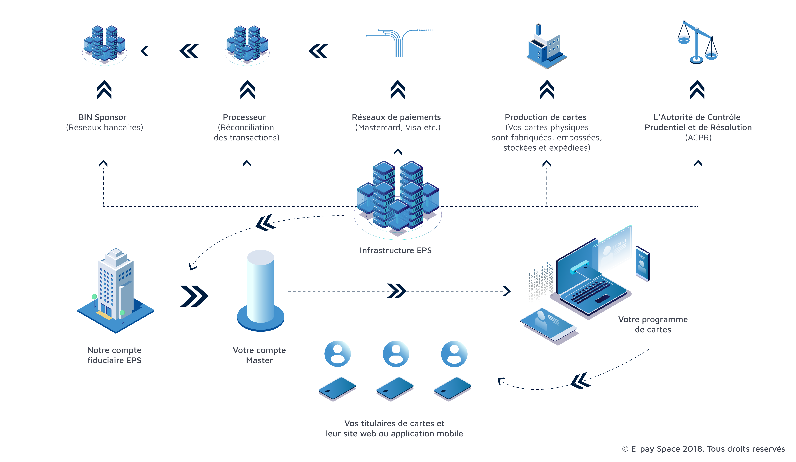

What is a company that does the Programme Management in the financial sector? 
###### 10 years ago, new players appeared with the introduction of the new status of electronic money institution (EME) in Europe. The new concept of « Programme Manager » emerged. The new European directive (reinforced by the reform of the single market for payments in euros) authorizes the issuance of electronic money without the need for bank support. Providing payment services then becomes accessible for organizations that are not banks. As a result, companies obtain regulated statuses and can issue means of payment, such as prepaid cards, under certain conditions. This opens up an ocean of possibilities. 
###### ===
###### But before talking about Program Management or Program Management, let's talk about program.
###### ===

**Finally, what is a payment program/programme?**

Let’s take the simplest example: rechargeable payment cards or prepaid cards which have seen their use explode in Europe. 
A card programme includes: 

* The issuance of electronic means of payment on the basis of a BIN number (Bank Identification Number: the reference code of the issuing account which can be seen on the first 6 digits of your card code). A ** BIN Sponsor ** intervenes here, which is an establishment with the regulated status of issuing electronic money, it may be a bank or any other similar organization. 

* The processing of payments includes operations and transactions between payer / paid / and payment medium: the organization managing this part is called a Processor 
* ** A payment network ** or more commonly referred to as a "Card Scheme" is the most well-known part of the system since it concerns global networks such as Visa, Mastercard, CB, Union Pay or American Express. Network members (especially merchants) accept payments within one or more networks. 
* **A Bureau**: quite simply the manufacturer who encodes and personalizes the means of payment. For example for the card: usually plastic, it is produced according to strict standards, from the chip to the numbers through to the magnetic strip. New Bureau are offering more and more original payment media such as metal or ceramic cards but also wearables such as connected jewelry). 
* **A supervisory authority**: in France, it is the ACPR (prudential control and resolution authority) which plays the role of regulator. This organization backed by the Banque de France supervises the activity with the aim of protecting users and ensuring the stability of the financial system. 
***A trust account** is an account managed by an independent and trusted third party that allows money to be processed on behalf of another person or entity. It is often the banking institution represented by the Bin Sponsor that manages it. 
* **An infrastructure**: platform that supports the entire system and communicates with the various players. It secures and centralizes exchanges and must be certified by a third party as to its robustness against cybercriminal attacks. 
* **A management website** or mobile application for end users and program administrators. The so-called "visible" part of the iceberg since it formalizes in the form of screens a user experience that processes information from the entire program (for example: the balance available on a card, past transactions, amounts loaded etc.). Now that the notion of program is clarified and all the stakeholders in the system are known, let's get back to our heads. 

**Where does the Programme Manager intervene? What is his role in all of this? **
###### By definition, the Program Manager manages the Program. Its role is to design, develop and manage the platform that will support the payment program and its services. Let's take an example. A company specializing in expense report management for SMEs wants to launch a program for its clients that manages professional expenses. To make its program attractive with a fluid and digitized experience, the company decides to provide employee badges that also serve as payment cards. Ideal for centralizing expense reports. The project seems completely feasible. But the company does not have the technical, human and financial resources to develop its own solution. The company does not have the bank approvals to issue cards and would like a program quickly implemented. Going through your traditional bank to create this service would take years. Knowing the ins and outs of such a program and then making contact yourself with all the stakeholders in the creation of a program (Bin Sponsor, Processor, Office ...) is a colossal job and it is not his heart of job. This is where the Program Manager comes in. Calling on a Program Manager means minimizing the number of contacts, minimizing risks, delays, regulatory burden but also costs! The Program Manager is an aggregator who coordinates and controls the different entities involved in providing the solution for the client. He develops the platform so that it is operational for the customer, secure and legally compliant. He is the customer's sole point of contact and the architect of the solution.
###### ===

===

In our example, the company will present its prepaid card project to its Program Manager, ask for a feasibility analysis and a delivery date. The Program Manager will take care of the rest in a short time (a few months depending on the program) on a transparent and controlled cost model. The company will only have to test the solution and provide it to its customers!
That's it. You are now knowledgeable about what a Program Manager is in the world of Fintech. So don’t hesitate any longer and get started! 
In our next article, we will see what a <a href="https://www.epayspace.com/en/ressources/blog/closed-loop">Close loop</a>. payment card. 
